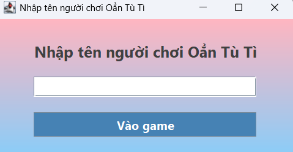
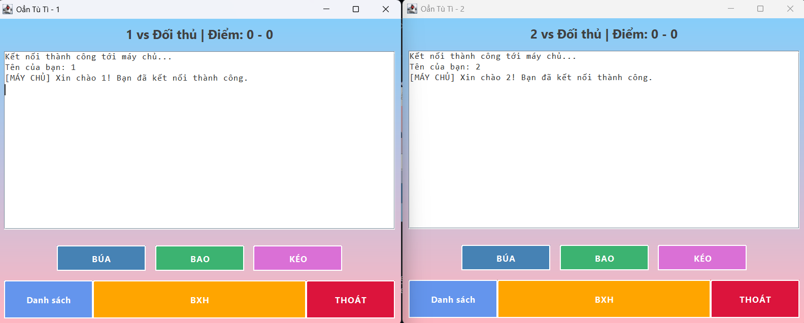
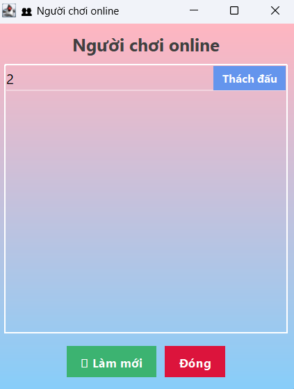
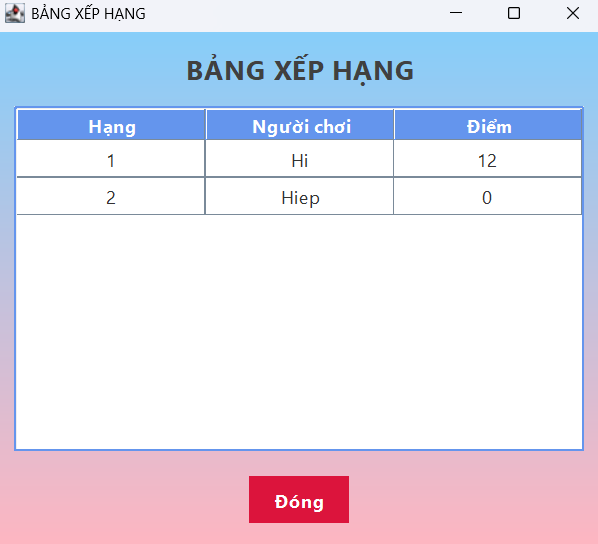

<h2 align="center">
    <a href="https://dainam.edu.vn/vi/khoa-cong-nghe-thong-tin">
    🎓 Faculty of Information Technology (DaiNam University)
    </a>
</h2>
<h2 align="center">
   TRÒ CHƠI OẲN TÙ TÌ QUA MẠNG
</h2>

    

        
        
        
    

## 📖 1. Giới thiệu
Đề tài “Trò chơi Oẳn Tù Tì qua mạng” giúp người học vận dụng kiến thức nền tảng về lập trình mạng để xây dựng một ứng dụng có tính tương tác trực tuyến dựa trên mô hình Client/Server. Ứng dụng được phát triển thông qua cơ chế giao tiếp bằng giao thức TCP Socket, cho phép nhiều người chơi tham gia và thực hiện các lượt chơi theo thời gian thực. Kết thúc đề tài, sinh viên có khả năng thiết kế, cài đặt và triển khai một trò chơi mạng đơn giản, nắm vững cách thức truyền nhận dữ liệu, xử lý đồng bộ giữa các client và áp dụng các nguyên tắc của lập trình mạng vào một ứng dụng thực tế.
### Các chức năng chính:
- Kết nối tới server: đảm bảo giao tiếp giữa nhiều client trong cùng một phiên chơi.
- Lựa chọn nước đi: người chơi có thể chọn Kéo – Búa – Bao.
- Xử lý và gửi kết quả: server nhận dữ liệu từ các client, so sánh lựa chọn và gửi kết quả thắng/thua/hòa về cho từng người chơi.
- Quản lý nhiều người chơi: hỗ trợ nhiều client tham gia cùng lúc thông qua cơ chế đa luồng.
- Hiển thị lịch sử kết quả: mỗi client có thể xem lại kết quả các lượt chơi đã tham gia.

## 🔧 2. Ngôn ngữ lập trình và công nghệ sử dụng: 
### Ngôn ngữ lập trình:

- Hỗ trợ mạnh mẽ cho lập trình mạng (Networking API).
- Tích hợp sẵn các thư viện để làm việc với Socket, luồng (Thread), I/O.
- Đa nền tảng (cross-platform), dễ triển khai trên nhiều hệ điều hành.

### Công nghệ sử dụng:
-   
  - Được sử dụng để tạo kết nối giữa Client – Server.  
  - Đảm bảo tính tin cậy, có thứ tự và không mất gói tin trong quá trình truyền dữ liệu.  
  - Phù hợp cho các ứng dụng cần trao đổi dữ liệu chính xác theo thời gian thực, ví dụ trò chơi hoặc chat.  
-   
  - **Server**: quản lý kết nối từ nhiều client, điều phối lượt chơi, xử lý logic so sánh kết quả, và trả phản hồi.  
  - **Client**: kết nối tới server, gửi lựa chọn (Kéo – Búa – Bao), và nhận kết quả.  
-   
  - Server sử dụng Thread để quản lý nhiều client cùng lúc.  
  - Đảm bảo tính song song, tránh hiện tượng “nghẽn” khi nhiều người chơi kết nối.  
-   
  - Dùng để truyền dữ liệu (chuỗi ký tự, thông điệp, lựa chọn của người chơi) giữa client và server.  
-   
  - IDE hỗ trợ phát triển: viết, biên dịch và debug chương trình Java.

## 🚀 3. Hình ảnh các chức năng chính
### Giao diện đăng nhập 

  

  

**Hình ảnh 1: Giao diện đăng nhập**

### Giao diện trò chơi Oẳn Tù Tì 

  

  

**Hình ảnh 2: Giao diện trò chơi chính**

### Giao diện hiển thị danh sách người chơi

  

  

**Hình ảnh 3: Giao diện dang sách người chơi**

### Giao diện bảng xếp hạng

  

**Hình ảnh 4: Giao diện bảng xếp hạng**

## 📝 4. Các bước cài đặt
🔹 Bước 1: Chuẩn bị môi trường
- Cài đặt Java JDK 8 hoặc mới hơn
- Tải tại: https://www.oracle.com/java/technologies/javase-downloads.html
- Sau khi cài đặt, mở Command Prompt / Terminal và kiểm tra:
  - java -version
- Nếu hiển thị java version "1.8.x" hoặc cao hơn nghĩa là cài đặt thành công.
- Cài đặt một IDE để dễ chạy code (khuyến nghị IntelliJ IDEA, cũng có thể dùng Eclipse hoặc NetBeans).

🔹 Bước 2: Tải mã nguồn
- Clone dự án từ GitHub:
- git clone https://github.com/your-repo/OanTuTi-Game.git
  - cd OanTuTi-Game
- Nếu không dùng Git, bạn có thể bấm nút Download ZIP trên GitHub, sau đó giải nén.

🔹 Bước 3: Mở dự án trong IDE
- Vào File → Open Project trong IDE.
- Chọn thư mục chứa source code (Client.java và Server.java).
- Đảm bảo IDE nhận diện dự án là Java Project.

🔹 Bước 4: Biên dịch và chạy Server
- Mở file Server.java.
- Nhấn Run để chạy server.
- Server sẽ lắng nghe kết nối.
- Nếu chạy thành công, IDE sẽ hiển thị log kiểu:
  - Server started on
  - Waiting for players...

🔹 Bước 5: Biên dịch và chạy Client
- Mở file Client.java.
- Nhấn Run để chạy client.
- Một cửa sổ giao diện hiện ra yêu cầu nhập:
- Địa chỉ IP server (mặc định 127.0.0.1 nếu client và server chạy cùng máy).
- Username (ví dụ: "Người chơi 1").

🔹 Bước 6: Bắt đầu chơi
- Khi có ít nhất 2 client kết nối thành công:
- Server sẽ tự động ghép cặp người chơi.
- Mỗi client chọn Kéo – Búa – Bao.
- Server xử lý kết quả và gửi lại cho cả hai client.
- Lịch sử kết quả sẽ hiển thị ngay trên giao diện client.
- Có thể tiếp tục chơi nhiều lượt mà không cần thoát game.

## 📬 5. Liên hệ
- Họ và tên: Trần Đình Hiệp
- Lớp: CNTT 16-03
- SDT: 0967925856

© 2025 AIoTLab, Faculty of Information Technology, DaiNam University. All rights reserved.

---